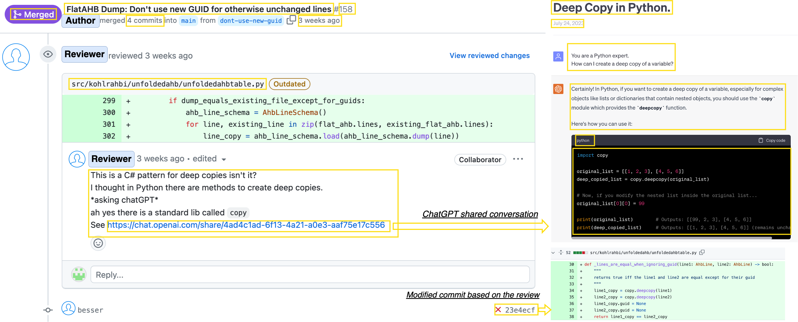

# DevGPT: Studying Developer-ChatGPT Conversations
[https://github.com/NAIST-SE/DevGPT/](https://github.com/NAIST-SE/DevGPT/)



## Presentation Slides
The presentation slides to explain this dataset and the MSR 2024 challenge is available at https://speakerdeck.com/taoxiaomark/devgpt-studying-developer-chatgpt-conversations

## Content
In this repository, we've incorporated six snapshots, each containing six JSON files encompassing GitHub Issues, Pull Requests, Discussions, Commits, Code Files, and Hacker News threads. Additionally, you can access the same dataset through the Zenodo data repository:
[](https://doi.org/10.5281/zenodo.10086809)


## Data Extraction

### GitHub [GraphQL](https://docs.github.com/en/graphql) and [REST](https://docs.github.com/en/rest?apiVersion=2022-11-28):
We performed a search function with the keyword `https://chat.openai.com/share/` in the GitHub GraphQL API to identify mentions of shared links in issues, pull requests, and discussions from GitHub. Since this function did not support searching special characters (e.g., `/` and `:`), we then identified the exact mentions of shared ChatGPT links by the regular expression:
```
https:\/\/chat\.openai\.com\/share\/[a-zA-Z0-9-]{36}
```
For the GitHub REST API, we performed the same keyword and regular expression to obtain the references of shared ChatGPT links in commits and code files from GitHub. Moreover, we applied additional filters (e.g., creation time) in order to work around GitHub’s limit on the search function, since it only supports a maximum of a thousand results per call. It's worth noting that the total count varies upon each API/[Webpage access](https://github.com/search?q=%22https%3A%2F%2Fchat.openai.com%2Fshare%2F%22&type=commits) in the GitHub, which leads to inconsistent results compared to the GitHub website.

### [HackerNews](https://hn.algolia.com/api): 
Similar to the GitHub search function, HackerNews also provides an endpoint (`http://hn.algolia.com/api/v1/search?query=...`) to obtain references of shared ChatGPT links in posts from HackerNews. The same regular expression was applied to further identify whether mentioned links are shared ChatGPT links.

### Shared ChatGPT conversations: 
After obtaining shared ChatGPT links from different sources, we fetched the web page of the shared conversation from ChatGPT. Since users could delete or inactivate the shared conversations, we fetched all data once a week (six snapshots in total from July 27, 2023, August 3, 2023, August 10, 2023, August 17, 2023, August 24, 2023, and August 31, 2023). If the response status is other than *200*, we obtain the data from the same shared link in all snapshots.

## Data Set Structure
GPTShare comprises six snapshots taken on July 27, 2023, August 3, 2023, August 10, 2023, August 17, 2023, August 24, 2023, and August 31, 2023. Each snapshot consists of six JSON files sourced differently. We name each JSON using a combination of its fetch time and source name. Additionally, we've provided a consolidated CSV file containing all ChatGPT links harvested from GitHub and Hacker News in each snapshot.
```
📁 /
├─ 📄 %Y%m%d_%H%M%S_file_sharing.json
├─ 📄 %Y%m%d_%H%M%S_hn_sharing.json
├─ 📄 %Y%m%d_%H%M%S_pr_sharing.json
├─ 📄 %Y%m%d_%H%M%S_issue_sharing.json
├─ 📄 %Y%m%d_%H%M%S_discussion_sharing.json
├─ 📄 %Y%m%d_%H%M%S_commit_sharing.json
├─ 📄 ChatGPT_Link_Sharing.csv
```

## Data Structure

### GitHub Code File
| Attribute    | Description |
| -------- | ------- |
| Type  | Source type   |
| URL | URL to the mentioned source     |
| ObjectSha    | Sha of the source     |
| FileName | Filename of this code file     |
| FilePath    | Filepath to this code file     |
| Author  | Author who introduced this mention   |
| Content | Content of this code file, which can be decoded by base64   |
| RepoName    | Name of the repository that contains this code file     |
| RepoLanguage  | Primary programming language of the repository that contains this code file **_NOTE:_** it can be null when this repository does not contain any code  |
| CommitSha | Sha of the commit that introduced this mention   |
| CommitMessage    | Message of the commit that introduced this mention     |
| AuthorAt  | When the author added this mention  |
| CommitAt | When the author committed this mention     |
| ChatgptSharing    | List of ChatGPT link mentions. Refer to the `ChatgptSharing` structure for details  |

### GitHub Commit
| Attribute    | Description |
| -------- | ------- |
| Type  | Source type   |
| URL | URL to the mentioned source     |
| Author  | Author who introduced this mention   |
| RepoName    | Name of the repository that contains this commit     |
| RepoLanguage  | Primary programming language of the repository that contains this commit **_NOTE:_** it can be null when this repository does not contain any code |
| Sha    | Sha of the source     |
| Message    | Message of this commit    |
| AuthorAt  | When the author added this mention  |
| CommitAt | When the author committed this mention     |
| ChatgptSharing    | List of ChatGPT link mentions. Refer to the `ChatgptSharing` structure for details  |

### GitHub Issue
| Attribute    | Description |
| -------- | ------- |
| Type  | Source type   |
| URL | URL to the mentioned source     |
| Author  | Author who introduced this mention   |
| RepoName    | Name of the repository that contains this issue     |
| RepoLanguage  | Primary programming language of the repository that contains this issue **_NOTE:_** it can be null when this repository does not contain any code |
| Number    | Issue number of this issue     |
| Title    | Title of this issue    |
| Body | Description of this issue     |
| AuthorAt  | When the author created this issue  |
| ClosedAt | When this issue was closed  **_NOTE:_** it can be null when this issue is not closed |
| UpdatedAt | When the latest update of this issue occurred |
| State | The state of this issue (i.e., OPEN and CLOSED)  |
| ChatgptSharing    | List of ChatGPT link mentions. Refer to the `ChatgptSharing` structure for details  |

### GitHub Pull Request
| Attribute    | Description |
| -------- | ------- |
| Type  | Source type   |
| URL | URL to the mentioned source     |
| Author  | Author who introduced this mention   |
| RepoName    | Name of the repository that contains this pull request     |
| RepoLanguage  | Primary programming language of the repository that contains this pull request **_NOTE:_** it can be null when this repository does not contain any code |
| Number    | Pull request number of this mention     |
| Title    | Title of this pull request |
| Body | Description of this pull request |
| CreatedAt  | When the author created this pull request |
| ClosedAt | When this pull request was closed  **_NOTE:_** it can be null when this issue is not closed |
| MergedAt | When this pull request was merged  **_NOTE:_** it can be null when this issue is not merged |
| UpdatedAt | When the latest update occurred |
| State | The state of this pull request (i.e., OPEN, CLOSED, MERGED)  |
| Additions | Number of lines added in this pull request |
| Deletions | Number of lines deleted in this pull request |
| ChangedFiles | Number of files changed in this pull request |
| CommitsTotalCount | Number of commits included in this pull request |
| CommitSha | A list of commit Shas that are included in this pull request |
| ChatgptSharing    | List of ChatGPT link mentions. Refer to the `ChatgptSharing` structure for details  |

### Hacker News
| Attribute    | Description |
| -------- | ------- |
| Type  | Source type   |
| ID  | Story ID of the mentioned source   |
| URL | URL to the mentioned source     |
| Author  | Author who introduced this mention   |
| Points | Number of points received from this story     |
| AttachedURL    | URL that is attached in this story **_NOTE:_** it can be null when this story does not attach the URL    |
| Title    | Title of this story **_NOTE:_** it can be null when this story does not have a title   |
| StoryText | Description of this story **_NOTE:_** it can be null when this story does not have a description   |
| CreatedAt  | When the author created this story  |
| CommentsTotalCount | Number of comments in this story  |
| ChatgptSharing    | List of ChatGPT link mentions. Refer to the `ChatgptSharing` structure for details  |

### GitHub Discussion
| Attribute    | Description |
| -------- | ------- |
| Type  | source type   |
| URL | URL to the mentioned source     |
| Author  | Author who introduced this mention   |
| RepoName    | Name of the repository that contains this discussion |
| RepoLanguage  | Primary programming language of the repository that contains this discussion **_NOTE:_** it can be null when this repository does not contain any code |
| Number    | Discussion number of this mention     |
| Title    | Title of this discussion |
| Body | Description of this discussion |
| AuthorAt  | When the author created this discussion  |
| ClosedAt | When this discussion was closed  **_NOTE:_** it can be null when this discussion is not closed |
| UpdatedAt | When the latest update of this discussion occurred |
| Closed | Whether or not this discussion is closed  |
| UpvoteCount | Number of upvotes that this discussion has received.  |
| ChatgptSharing    | List of ChatGPT link mentions. Refer to the `ChatgptSharing` structure for details  |

### ChatgptSharing
| Attribute    | Description |
| -------- | ------- |
| URL | URL to the shared ChatGPT links     |
| Mention | Attributes about mention. Refer to the `Mention` structure for details     |
| Status  | HTTP response status when accessing this URL  |
| DateOfConversation    | Date when this conversation occurred     |
| DateOfAccess  | Date when we accessed this URL    | 
| NumberOfPrompts    | Number of prompts in this conversation    |
| TokensOfPrompts    | Number of tokens of prompts in this conversation    |
| TokensOfAnswers | Tokens of answers in this conversation     |
| Model  | 	Version of the model used in this conversation  |
| Conversations    | List of conversations. Refer to the `Conversations` structure for details |
| HTMLContent  | HTML content from the shared ChatGPT link |

### Mention
| Attribute    | Description |
| -------- | ------- |
| MentionedURL | URL to the mentioned source     |
| MentionedProperty  | What kind of property was mentioned in this shared ChatGPT link   |
| MentionedAuthor    | Who mentioned this shared ChatGPT link    |
| MentionedText  | The context when this shared ChatGPT link was mentioned     |
| MentionedPath    | Where the comment was added in files for reference of shared ChatGPT links in review threads of GitHub pull requests (only exists when referenced in review threads of pull requests)   |
| MentionedIsAnswer    | Whether this comment is marked as an answer in discussion (only exists when referenced in comments of discussion) |
| MentionedUpvoteCount    | Number of upvotes that this comment has received (only exists when referenced in comments of discussion)  |

### Conversations
| Attribute    | Description |
| -------- | ------- |
| Prompt | Prompt that user inputted     |
| Answer  | Answer that ChatGPT generated   |
| ListOfCode    | Code list from the answer (includes code type and content)   |

## Code to crawl shared ChatGPT conversations

```
async def fetch_page(browser, url):
    page = await browser.newPage()
    await page.setUserAgent(random.choice(USER_AGENTS))
    response = await page.goto(url, waitUntil='domcontentloaded', timeout=200000)
    if response.status != 200:
        await page.close()
        return response.status
    content = await page.content()
    await page.close()
    return content


async def obtain_from_chatgpt_sharing(url, mention):
    revised_url = url.replace('https://chat.openai.com/share/','https://chatgpt.com/share/')
    content = await fetch_page(browser, revised_url)
    if isinstance(content, int): 
        return {
                        "URL": url,
                        "Mention": mention,
                        "Status": content,
                    }
    else:
        
        try:
            soup = BeautifulSoup(content, "html.parser")
            data = json.loads(soup.find('script', type='application/json').text)
        except JSONDecodeError: 
            content = await fetch_page(browser, revised_url)
            if isinstance(content, int): 
                return {
                                "URL": url,
                                "Mention": mention,
                                "Status": content,
                            }
            else:
                try:
                    soup = BeautifulSoup(content, "html.parser")
                    data = json.loads(soup.find('script', type='application/json').text)
                except JSONDecodeError:
                    return {
                            "URL": url,
                            "Mention": mention,
                            "Status": 404,
                        }
        values = list(data['props']['pageProps']['serverResponse']['data']['mapping'].values())
        values.reverse()
        conversations = []
        prompts = []
        answer, prompt = None, None
        answer_tokens = 0
        is_assistant = False
        model = None
        turn = 0
        for mapping in values:
            if 'message' in mapping:
                if 'model_slug' in mapping['message']['metadata'] and model is None:
                    if "text-davinci-002-render-sha" in mapping['message']['metadata']['model_slug']:
                        model = 'GPT-3.5'
                    else:
                        model = mapping['message']['metadata']['model_slug'].upper()
                if mapping['message']['content']['content_type'] == 'code': continue                 
                if mapping['message']['author']['role'] == 'user':
                    prompt = mapping['message']['content']['parts'][0]
                    prompts.append(prompt)
                    is_assistant = False
                if mapping['message']['author']['role'] == 'assistant':
                    if 'parts' not in mapping['message']['content']: continue
                    if is_assistant and len(conversations) > 0:
                        last_answer = conversations[-1]['Answer']
                        last_code_blocks = conversations[-1]['ListOfCode']
                        answer = mapping['message']['content']['parts'][0]
                        answer_tokens += get_num_tokens_from_string(answer)
                        code_contents = re.findall(r'```[\s\S]*?```', answer, re.DOTALL)
                        code_blocks = []
                        for code_content in code_contents:
                            code_type = code_content.split('\n')[0][3:]
                            code_type = code_type if code_type != '' else None
                            answer = answer.replace(code_content, f"[CODE_BLOCK_{index}]")
                            code_content = '\n'.join(code_content.split('\n')[1:-1])
                            code_block = {
                                            "ReplaceString": f"[CODE_BLOCK_{index}]",
                                            "Type": code_type,
                                            "Content": code_content
                                            }
                            code_blocks.append(code_block)
                            index += 1
                        answer = last_answer + '\n' + answer
                        conversations[-1]['Answer'] = answer
                        last_code_blocks.extend(code_blocks)
                        conversations[-1]['ListOfCode'] = code_blocks
                    else:
                        answer = mapping['message']['content']['parts'][0]
                        answer_tokens += get_num_tokens_from_string(answer)
                        code_contents = re.findall(r'```[\s\S]*?```', answer, re.DOTALL)
                        code_blocks = []
                        index = 0
                        for code_content in code_contents:
                            code_type = code_content.split('\n')[0][3:]
                            code_type = code_type if code_type != '' else None
                            answer = answer.replace(code_content, f"[CODE_BLOCK_{index}]")
                            code_content = '\n'.join(code_content.split('\n')[1:-1])
                            code_block = {
                                            "ReplaceString": f"[CODE_BLOCK_{index}]",
                                            "Type": code_type,
                                            "Content": code_content
                                            }
                            code_blocks.append(code_block)
                            index += 1
                    is_assistant = True

        
            if answer is not None and prompt is not None:
                turn += 1
                conversations.append(
                    {
                        "Prompt": prompt,
                         "Answer": answer,
                         "ListOfCode": code_blocks,
                        "ConvIndex": create_hash_index(url, turn)
                    })
                answer, prompt = None, None
        
        return {
            "URL": url,
            "Mention": mention,
            "Status": 200,
            "DateOfConversation": datetime.datetime.fromtimestamp(data['props']['pageProps']['serverResponse']['data']['create_time']).strftime('%B %-d, %Y'),
            "Title": data['props']['pageProps']['serverResponse']['data']['title'],
            "NumberOfPrompts": len(prompts),
            "TokensOfPrompts": sum([get_num_tokens_from_string(prompt) for prompt in prompts]),
            "TokensOfAnswers": answer_tokens,
            "Model": model,
            "Conversations": conversations,
            "HTMLContent": str(soup)
        }
```
